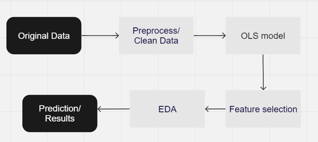

# Fetal-Health-Project

## Motivation:

### Problem statement:

- Under-five mortality is greatly influenced by the death of children in the first month of their life. Perinatal mortality is largely caused by intrapartum complications. However, Cardiotocograms (CTGs), which are simple and affordable, can serve as a monitoring tool to assess fetal health and identify high-risk women during labor.

### Project importance:

- To help achieve the MDG 4 goal of globally reducing under-five mortality by two-thirds. Additionally, to reduce maternal mortality, which accounts for 295,000 deaths during pregnancy and childbirth, with 94% occurring in low-resource settings, many of which are preventable.

### Dataset description:

- Our dataset consists of 2126 CTG exam records of pregnant women in their third trimester. It includes 22 features, with Fetal Health classified into three classes (Normal as 1, Suspect as 2, and Pathological as 3) by expert obstetricians.

### Project objectives:
1. To identify the most significant features for detecting high-risk fetal health conditions.
2. To analyze the precision of CTG model algorithms in correctly classifying instances.
3. Based on the model evaluation result, propose the global scale-up of CTG usage, with a focus on regions burdened by high newborn and maternal mortality.

### Approach

